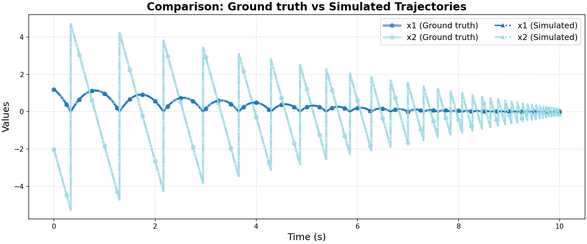

# Ground Truth 0 Evaluation: ATVA/ball

**HA Specification**: `evaluation_results_gemini3flash_260129/ATVA/ball/runs/20260125_174104_11ed/best_ha_specification.json`
**Ground Truth File**: `data_all/ATVA/ball_g/ground_truth_0.npz`
**Iterations**: 2 (max_iter: 2)

## Metrics

| Metric | Value |
|--------|-------|
| tc (time correlation) | 0.0 |
| max_diff | 0.0 |
| mean_diff | 0.0 |
| clustering_error | 0 |
| status | success |

