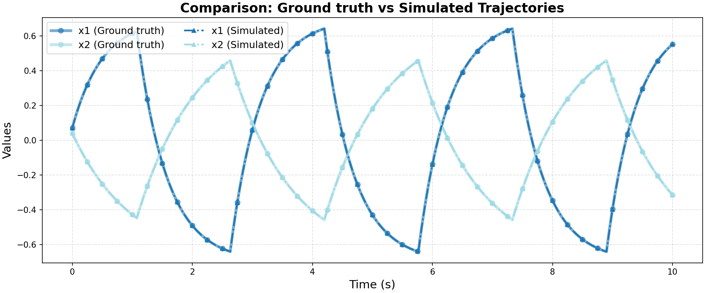

# Ground Truth 0 Evaluation: ATVA/oci

**HA Specification**: `evaluation_results_gemini3flash_260129/ATVA/oci/runs/20260125_174104_d99d/best_ha_specification.json`
**Ground Truth File**: `data_all/ATVA/oci_g/ground_truth_0.npz`
**Iterations**: 15 (max_iter: 15)

## Metrics

| Metric | Value |
|--------|-------|
| tc (time correlation) | 0.002 |
| max_diff | 0.008347210552456429 |
| mean_diff | 0.002546690026531761 |
| clustering_error | 0 |
| status | success |

