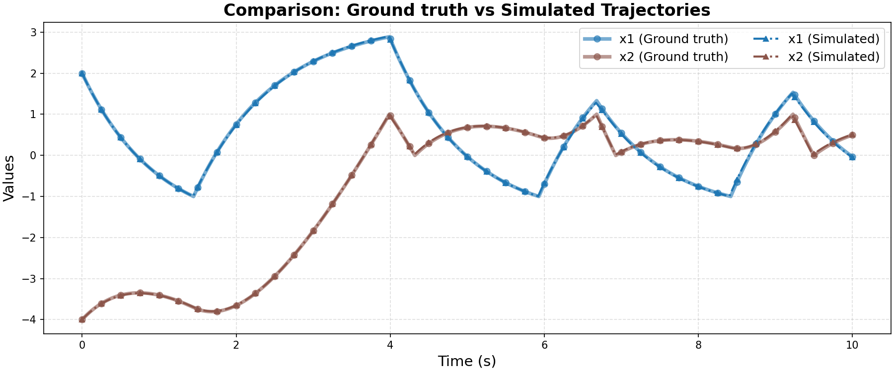

# Ground Truth 0 Evaluation: ATVA/tanks

**HA Specification**: `evaluation_results_gemini3flash_260129/ATVA/tanks/runs/20260125_174104_3558/best_ha_specification.json`
**Ground Truth File**: `data_all/ATVA/tanks_g/ground_truth_0.npz`
**Iterations**: 32 (max_iter: 50)

## Metrics

| Metric | Value |
|--------|-------|
| tc (time correlation) | 0.016 |
| max_diff | 0.025579874910132815 |
| mean_diff | 0.0028053672801369544 |
| clustering_error | 0 |
| status | success |

