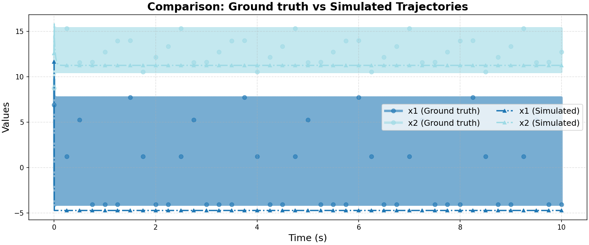

# Ground Truth 0 Evaluation: FaMoS/buck_converter

**HA Specification**: `evaluation_results_gemini3flash_260129/FaMoS/buck_converter/runs/20260125_175904_0056/best_ha_specification.json`
**Ground Truth File**: `data_all/FaMoS/buck_converter_g/ground_truth_0.npz`
**Iterations**: 34 (max_iter: 50)

## Metrics

| Metric | Value |
|--------|-------|
| tc (time correlation) | 4.997 |
| max_diff | 1.2865736157865795 |
| mean_diff | 0.2694489348245992 |
| clustering_error | 0 |
| status | success |

