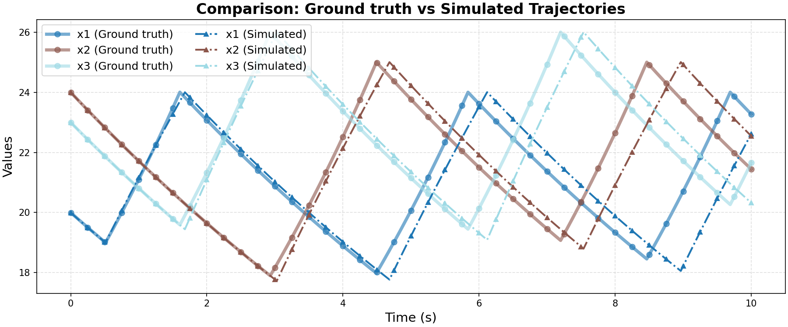

# Ground Truth 0 Evaluation: FaMoS/multi_room_heating

**HA Specification**: `evaluation_results_gemini3flash_260129/FaMoS/multi_room_heating/runs/20260125_211249_21a4/best_ha_specification.json`
**Ground Truth File**: `data_all/FaMoS/multi_room_heating_g/ground_truth_0.npz`
**Iterations**: 37 (max_iter: 49)

## Metrics

| Metric | Value |
|--------|-------|
| tc (time correlation) | 0.501 |
| max_diff | 0.11260060125062947 |
| mean_diff | 0.02171113072079398 |
| clustering_error | 0 |
| status | success |

