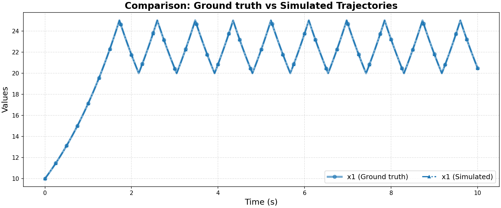

# Ground Truth 0 Evaluation: FaMoS/simple_heating_system

**HA Specification**: `evaluation_results_gemini3flash_260129/FaMoS/simple_heating_system/runs/20260126_004441_663a/best_ha_specification.json`
**Ground Truth File**: `data_all/FaMoS/simple_heating_system_g/ground_truth_0.npz`
**Iterations**: 7 (max_iter: 22)

## Metrics

| Metric | Value |
|--------|-------|
| tc (time correlation) | 0.004 |
| max_diff | 0.0020693501453859253 |
| mean_diff | 0.0007992261792062344 |
| clustering_error | 0 |
| status | success |

