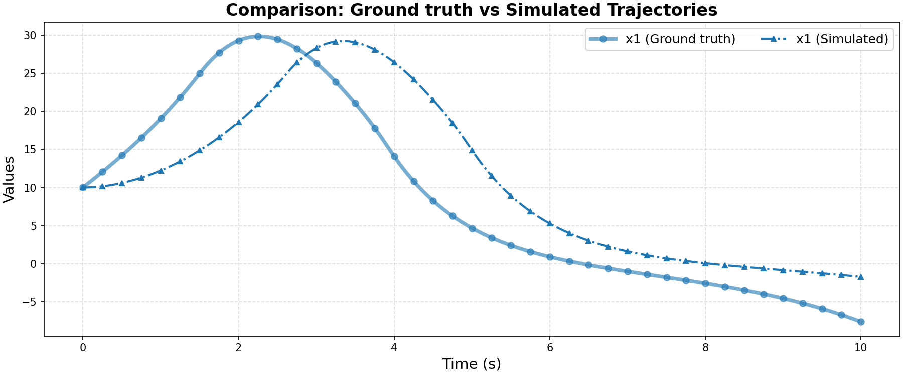

# Ground Truth 0 Evaluation: FaMoS/three_state_ha

**HA Specification**: `evaluation_results_gemini3flash_260129/FaMoS/three_state_ha/runs/20260126_131447_c476/best_ha_specification.json`
**Ground Truth File**: `data_all/FaMoS/three_state_ha_g/ground_truth_0.npz`
**Iterations**: 22 (max_iter: 50)

## Metrics

| Metric | Value |
|--------|-------|
| tc (time correlation) | 1.12 |
| max_diff | 0.4503230609369298 |
| mean_diff | 0.19951519456987127 |
| clustering_error | 0 |
| status | success |

