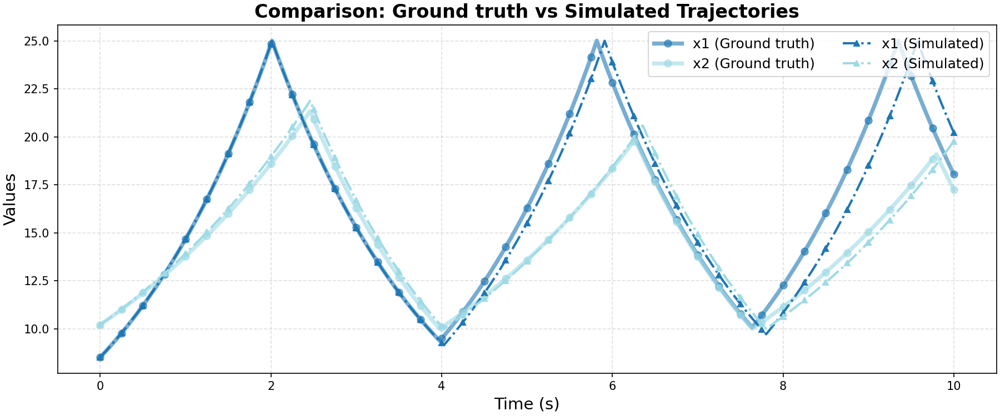

# Ground Truth 0 Evaluation: FaMoS/variable_heating_system

**HA Specification**: `evaluation_results_gemini3flash_260129/FaMoS/variable_heating_system/runs/20260126_183741_61e8/best_ha_specification.json`
**Ground Truth File**: `data_all/FaMoS/variable_heating_system_g/ground_truth_0.npz`
**Iterations**: 14 (max_iter: 50)

## Metrics

| Metric | Value |
|--------|-------|
| tc (time correlation) | 0.228 |
| max_diff | 0.11797866529219403 |
| mean_diff | 0.024392050454771726 |
| clustering_error | 0 |
| status | success |

