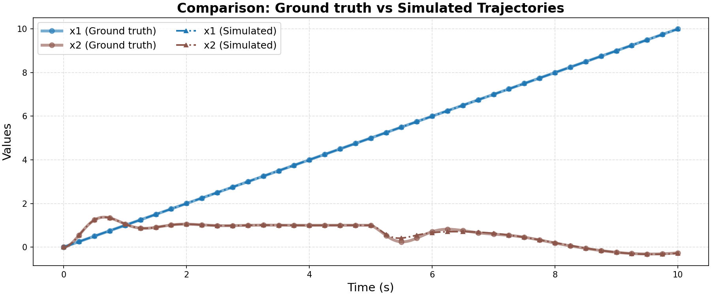

# Ground Truth 0 Evaluation: linear/complex_underdamped_system

**HA Specification**: `evaluation_results_gemini3flash_260129/linear/complex_underdamped_system/runs/20260126_202153_5a8a/best_ha_specification.json`
**Ground Truth File**: `data_all/linear/complex_underdamped_system_g/ground_truth_0.npz`
**Iterations**: 19 (max_iter: 50)

## Metrics

| Metric | Value |
|--------|-------|
| tc (time correlation) | 0.0 |
| max_diff | 0.13558095241853124 |
| mean_diff | 0.006932841356738209 |
| clustering_error | 1 |
| status | success |

