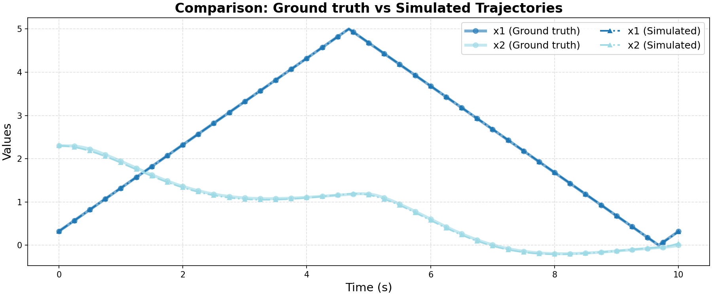

# Ground Truth 0 Evaluation: linear/dc_motor_position_PID

**HA Specification**: `evaluation_results_gemini3flash_260129/linear/dc_motor_position_PID/runs/20260127_115016_3211/best_ha_specification.json`
**Ground Truth File**: `data_all/linear/dc_motor_position_PID_g/ground_truth_0.npz`
**Iterations**: 30 (max_iter: 31)

## Metrics

| Metric | Value |
|--------|-------|
| tc (time correlation) | 0.004 |
| max_diff | 0.01879857542003937 |
| mean_diff | 0.004847899112929865 |
| clustering_error | 0 |
| status | success |

