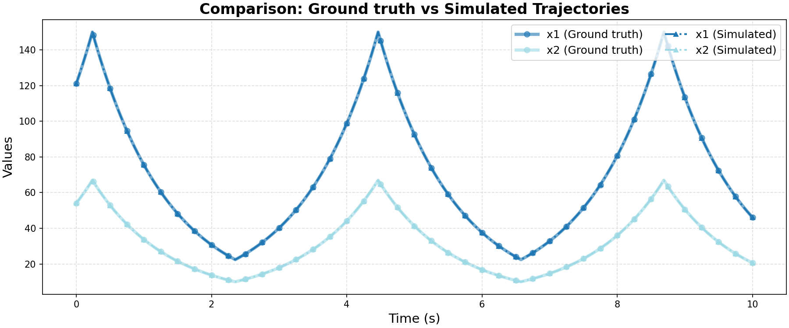

# Ground Truth 0 Evaluation: linear/linear_1

**HA Specification**: `evaluation_results_gemini3flash_260129/linear/linear_1/runs/20260127_132035_95e8/best_ha_specification.json`
**Ground Truth File**: `data_all/linear/linear_1_g/ground_truth_0.npz`
**Iterations**: 1 (max_iter: 1)

## Metrics

| Metric | Value |
|--------|-------|
| tc (time correlation) | 0.0 |
| max_diff | 0.0 |
| mean_diff | 0.0 |
| clustering_error | 0 |
| status | success |

