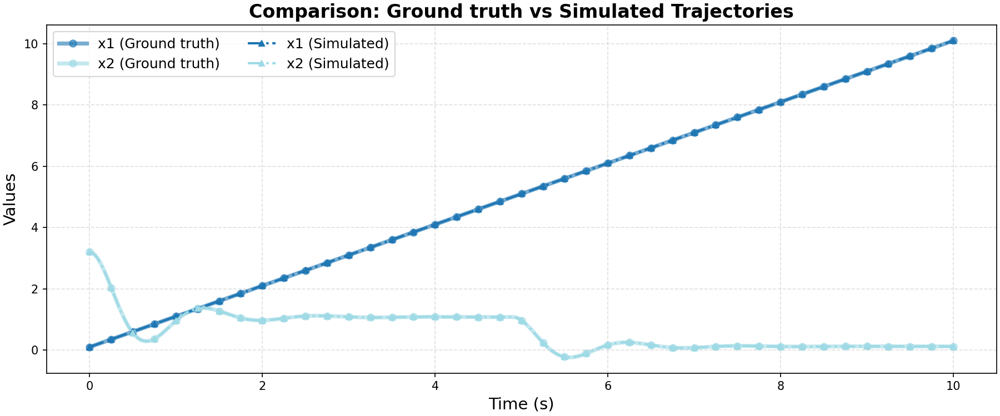

# Ground Truth 0 Evaluation: linear/loop

**HA Specification**: `evaluation_results_gemini3flash_260129/linear/loop/runs/20260127_134200_a220/best_ha_specification.json`
**Ground Truth File**: `data_all/linear/loop_g/ground_truth_0.npz`
**Iterations**: 2 (max_iter: 2)

## Metrics

| Metric | Value |
|--------|-------|
| tc (time correlation) | 0.1 |
| max_diff | 0.002221224833108235 |
| mean_diff | 7.236273767643271e-05 |
| clustering_error | 1 |
| status | success |

