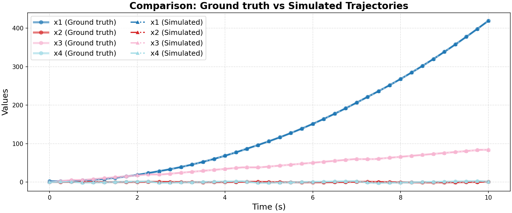

# Ground Truth 0 Evaluation: linear/one_legged_jumper

**HA Specification**: `evaluation_results_gemini3flash_260129/linear/one_legged_jumper/runs/20260127_142225_2051/best_ha_specification.json`
**Ground Truth File**: `data_all/linear/one_legged_jumper_g/ground_truth_0.npz`
**Iterations**: 3 (max_iter: 3)

## Metrics

| Metric | Value |
|--------|-------|
| tc (time correlation) | 0.0 |
| max_diff | 0.0 |
| mean_diff | 0.0 |
| clustering_error | 0 |
| status | success |

