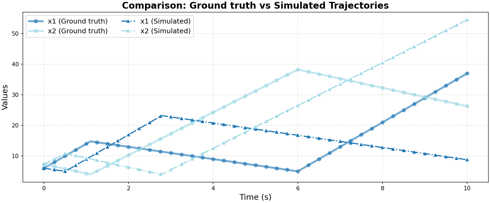

# Ground Truth 0 Evaluation: linear/two_tank

**HA Specification**: `evaluation_results_gemini3flash_260129/linear/two_tank/runs/20260127_154306_31b9/best_ha_specification.json`
**Ground Truth File**: `data_all/linear/two_tank_g/ground_truth_0.npz`
**Iterations**: 11 (max_iter: 11)

## Metrics

| Metric | Value |
|--------|-------|
| tc (time correlation) | 3.216 |
| max_diff | 0.7625378296584279 |
| mean_diff | 0.25821465901523416 |
| clustering_error | 0 |
| status | success |

