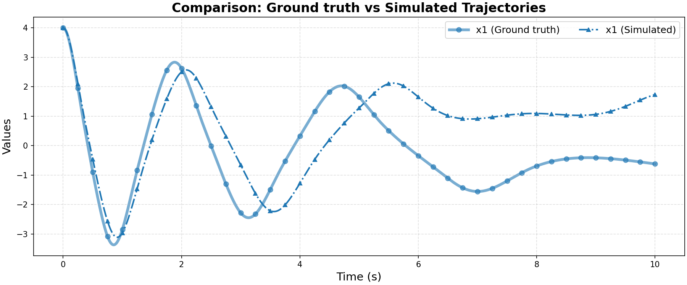

# Ground Truth 0 Evaluation: non_linear/duffing

**HA Specification**: `evaluation_results_gemini3flash_260129/non_linear/duffing/runs/20260127_163445_d5e5/best_ha_specification.json`
**Ground Truth File**: `data_all/non_linear/duffing_g/ground_truth_0.npz`
**Iterations**: 18 (max_iter: 50)

## Metrics

| Metric | Value |
|--------|-------|
| tc (time correlation) | 2.129 |
| max_diff | 0.6184906772143939 |
| mean_diff | 0.3443114097403637 |
| clustering_error | 0 |
| status | success |

