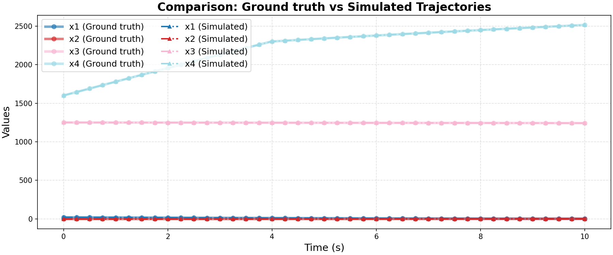

# Ground Truth 0 Evaluation: non_linear/lander

**HA Specification**: `evaluation_results_gemini3flash_260129/non_linear/lander/runs/20260127_175716_18f1/best_ha_specification.json`
**Ground Truth File**: `data_all/non_linear/lander_g/ground_truth_0.npz`
**Iterations**: 4 (max_iter: 4)

## Metrics

| Metric | Value |
|--------|-------|
| tc (time correlation) | 0.001 |
| max_diff | 0.0002639846723184645 |
| mean_diff | 5.179742066383718e-05 |
| clustering_error | 0 |
| status | success |

