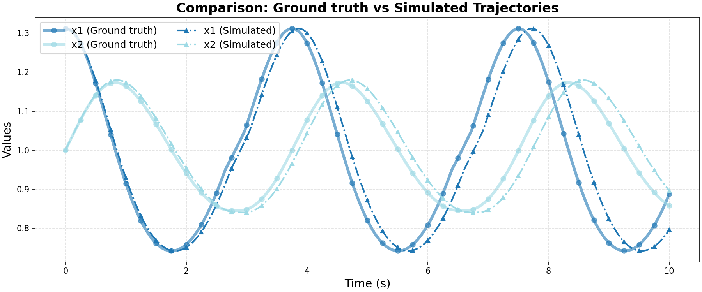

# Ground Truth 0 Evaluation: non_linear/lotkaVolterra

**HA Specification**: `evaluation_results_gemini3flash_260129/non_linear/lotkaVolterra/runs/20260127_175808_9d8f/best_ha_specification.json`
**Ground Truth File**: `data_all/non_linear/lotkaVolterra_g/ground_truth_0.npz`
**Iterations**: 15 (max_iter: 15)

## Metrics

| Metric | Value |
|--------|-------|
| tc (time correlation) | 0.203 |
| max_diff | 0.09752026432042751 |
| mean_diff | 0.02783525963421733 |
| clustering_error | 0 |
| status | success |

