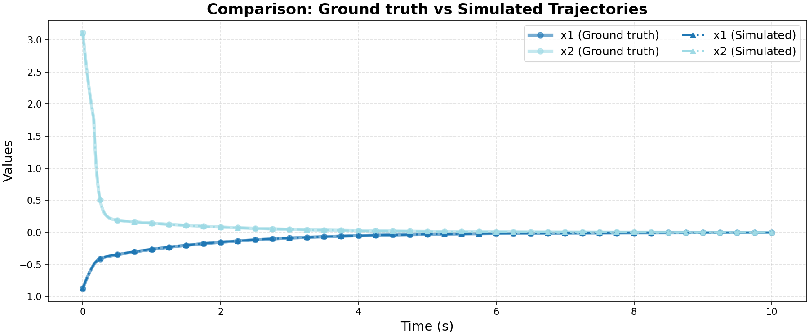

# Ground Truth 0 Evaluation: non_linear/oscillator

**HA Specification**: `evaluation_results_gemini3flash_260129/non_linear/oscillator/runs/20260127_193518_3bc4/best_ha_specification.json`
**Ground Truth File**: `data_all/non_linear/oscillator_g/ground_truth_0.npz`
**Iterations**: 13 (max_iter: 50)

## Metrics

| Metric | Value |
|--------|-------|
| tc (time correlation) | 0.004 |
| max_diff | 0.027291983126967595 |
| mean_diff | 0.0007568851187542831 |
| clustering_error | 0 |
| status | success |

