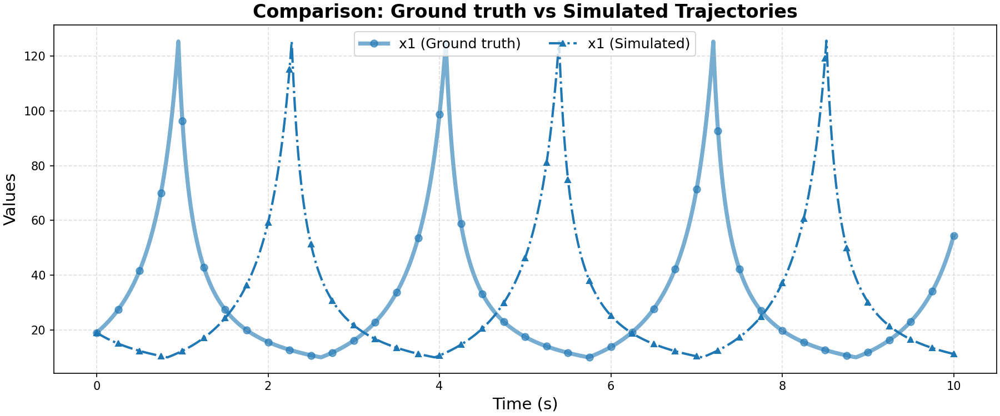

# Ground Truth 0 Evaluation: non_linear/simple_non_linear

**HA Specification**: `evaluation_results_gemini3flash_260129/non_linear/simple_non_linear/runs/20260128_075951_87bb/best_ha_specification.json`
**Ground Truth File**: `data_all/non_linear/simple_non_linear_g/ground_truth_0.npz`
**Iterations**: 29 (max_iter: 45)

## Metrics

| Metric | Value |
|--------|-------|
| tc (time correlation) | 0.34400000000000003 |
| max_diff | 0.9070204565028915 |
| mean_diff | 0.2678780548051564 |
| clustering_error | 0 |
| status | success |

