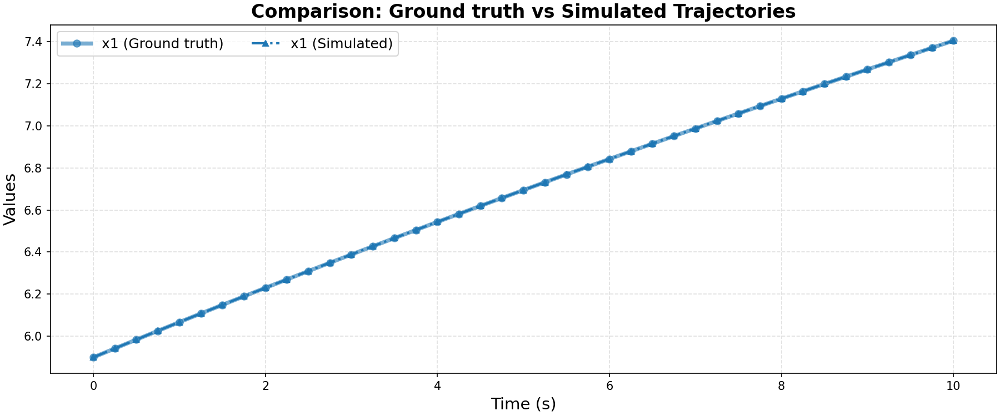

# Ground Truth 0 Evaluation: non_linear/simple_non_poly

**HA Specification**: `evaluation_results_gemini3flash_260129/non_linear/simple_non_poly/runs/20260128_101354_b6a3/best_ha_specification.json`
**Ground Truth File**: `data_all/non_linear/simple_non_poly_g/ground_truth_0.npz`
**Iterations**: 1 (max_iter: 7)

## Metrics

| Metric | Value |
|--------|-------|
| tc (time correlation) | 0.0 |
| max_diff | 0.0 |
| mean_diff | 0.0 |
| clustering_error | 0 |
| status | success |

