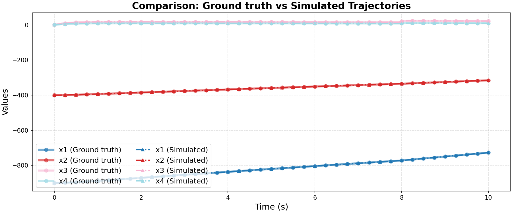

# Ground Truth 0 Evaluation: non_linear/spacecraft

**HA Specification**: `evaluation_results_gemini3flash_260129/non_linear/spacecraft/runs/20260128_132848_dd3f/best_ha_specification.json`
**Ground Truth File**: `data_all/non_linear/spacecraft_g/ground_truth_0.npz`
**Iterations**: 27 (max_iter: 30)

## Metrics

| Metric | Value |
|--------|-------|
| tc (time correlation) | 0.012 |
| max_diff | 0.06728254520012784 |
| mean_diff | 0.0012311639092857413 |
| clustering_error | 0 |
| status | success |

