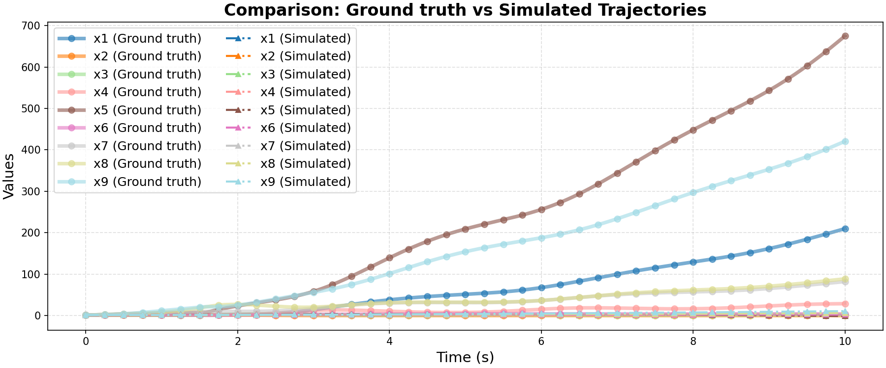

# Ground Truth 0 Evaluation: non_linear/sys_bio

**HA Specification**: `evaluation_results_gemini3flash_260129/non_linear/sys_bio/runs/20260128_143639_2da0/best_ha_specification.json`
**Ground Truth File**: `data_all/non_linear/sys_bio_g/ground_truth_0.npz`
**Iterations**: 20 (max_iter: 28)

## Metrics

| Metric | Value |
|--------|-------|
| tc (time correlation) | 1.577 |
| max_diff | 1.002013853802968 |
| mean_diff | 0.3614074157491782 |
| clustering_error | 1 |
| status | success |

